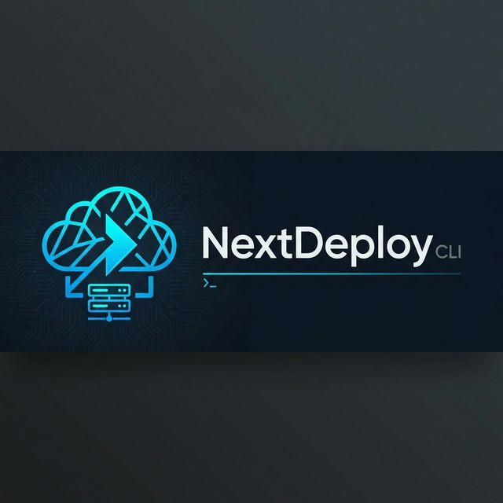

# NextDeploy: The Ultimate "Zero to Production" Engine



NextDeploy is a lightning-fast, zero-configuration deployment engine built explicitly for **Next.js**. It bridges the gap between your local development environment and production—whether that means a native Linux VPS or a globally distributed Serverless AWS architecture.

## 🚀 The Core Philosophy
Docker is heavy. SSH pipelines are brittle. Vercel is expensive.
NextDeploy believes in **Native Execution**. By utilizing Go, `systemd`, Caddy, and CloudFront natively, we orchestrate your fullstack Next.js applications using the bare-metal primitives of the web, guaranteeing maximum performance with zero overhead.

---

## 🏰 Our Main Moat: Fullstack Next.js on AWS (Serverless)

While NextDeploy offers incredible zero-downtime VPS deployments, our true competitive advantage (our "moat") is our ability to natively deploy **Fullstack Next.js to AWS Serverless** without Vendor Lock-in.

When you configure NextDeploy for `TargetType: "serverless"`:
1. **Intelligent Payload Splitting:** The CLI natively analyzes your `.nextdeploy/metadata.json` Route Plan.
2. **CDN Static Offloading:** All `/_next/static/*` assets and `public/` files are zipped and securely synced directly to an **Amazon S3 Bucket**, fronted by **CloudFront** with `immutable` Edge caching.
3. **The Lambda Web Adapter:** Your Next.js Node/Bun process is packaged alongside the [AWS Lambda Web Adapter](https://github.com/awslabs/aws-lambda-web-adapter). This allows your standard Next.js SSR server, API routes, and Middleware to run unmodified inside an **AWS Lambda Function**.
4. **Zero-Config Routing:** NextDeploy automatically wires CloudFront to route static requests to S3 and dynamic/API requests to Lambda.

**The Result:** You get Vercel-like globally distributed auto-scaling and edge caching, all deployed directly into *your* AWS account where it costs pennies, entirely automated via the NextDeploy CLI.

---

## 💻 Getting Started (The Developer Experience)

NextDeploy is designed to be frictionless.

### 1. Initialization
Run this once in your Next.js project directory:
```bash
nextdeploy init
```
*NextDeploy will instantly analyze your Next.js project, identifying your Router Type (App/Pages), Output Mode, and static/dynamic route counts. It scaffolds a `nextdeploy.yml` configuration file.*

### 2. Configure Your Target
Edit your `nextdeploy.yml`:
**For VPS:**
```yaml
version: 1.0
target_type: "vps"
servers:
  - host: 192.168.1.100
    ssh_key: "~/.ssh/id_rsa"
```
**For Serverless (AWS):**
```yaml
version: 1.0
target_type: "serverless"
serverless:
  provider: "aws"
  region: "us-east-1"
  s3_bucket: "my-nextjs-assets"
```

### 3. Server Preparation (VPS Only)
If deploying to a VPS, run:
```bash
nextdeploy prepare
```
*NextDeploy securely connects via Trust-On-First-Use (TOFU) SSH, installs Node.js/Bun, configures Caddy, and installs the `nextdeployd` daemon.*

### 4. Continuous Integration (Zero-Touch)
Don't want to deploy from your laptop?
```bash
nextdeploy generate-ci
```
*This generates a `.github/workflows/nextdeploy.yml` GitHub Action. Simply add your SSH Key to GitHub Secrets, push to `main`, and NextDeploy handles the rest automatically in the cloud.*

### 5. Deployment (The Act of Shipping)
When you are ready, or when your CI/CD pipeline triggers:
```bash
nextdeploy build
nextdeploy deploy
```
* The CLI analyzes your route plan.
* **If VPS:** It uploads your bundle, and `nextdeployd` extracts it to a new `release/` directory, orchestrating a zero-downtime port swap and Caddy reload.
* **If Serverless:** It executes the AWS S3 Sync and Lambda Web Adapter wrap, deploying your fullstack app infinitely scalable.

---

## 🛠 Advanced Features

### Zero-Downtime Hot Swaps (VPS)
NextDeploy uses a release/symlink architecture. Every deployment is a new timestamped folder. The daemon dynamically spins up the new process on a vacant port, health-checks it, and instantly points Caddy to the new port before seamlessly draining the old process. You experience 0 seconds of 502 Bad Gateway errors.

### Instant Rollbacks
Because old releases are kept on disk:
```bash
nextdeploy rollback
```
*Instantly shifts the `/current` symlink to the previous release and reloads Caddy.*

### Native Log Streaming
```bash
nextdeploy logs --route /api/webhook
```
*Streams native systemd journal logs, with the ability to filter by specific Next.js request paths.*
